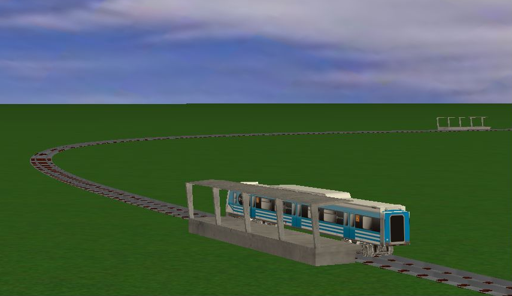

# IG-trenes
Generador de imágenes para simulación ferroviaria

Proyectos:
- CIGIHostAdapter: Software de control para el empaquetamiento de mensajes de estado según el protocolo CIGI.
- osgCigi: Librería para la representación de simulaciones remotas CIGI, mediante grafos de escena basados en OpenSceneGraph.
- TrenesIG: Generador de imágenes basado en OpenSceneGraph para la visualización de una simulación ferroviaria.
- VirtualSimulationEnvironment (desactivado): modelo de datos para la representación de entornos virtuales.

Tesis de Grado de Ingeniería en Informática - Facultad de Ingeniería UBA.

